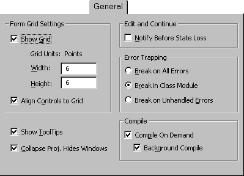

# General Tab (Options Dialog Box)

Specifies the settings, error handling, and compile settings for your current Visual Basic project.

## Tab Options

 **Form Grid Settings**

Determines the appearance of the form when it is edited.

- Show Grid — Determines whether to show the grid.
    
- Grid Units — Displays the grid units used for the form.
    
- Width — Determines the width of grid cells on a form (2 to 60 points).
    
- Height — Determines the height of grid cells on a form (2 to 60 points).
    
- Align Controls to Grid — Automatically positions the outer edges of controls on grid lines.
    

 **Show ToolTips**

Displays ToolTips for the toolbar buttons.

 **Collapse Proj. Hides Windows**

Determines whether the project,  **UserForm**, object, or module windows are closed automatically when a project is collapsed in the **Project** **Explorer**.

 **Edit and Continue**

- Notify Before State Loss — Determines whether you will receive a message notifying you that the action requested will cause the all module level variables to be reset for a running project.
    

 **Error Trapping**

Determines how errors are handled in the Visual Basic development environment. Setting this option affects all instances of Visual Basic started after you change the setting.

- Break on All Errors — Any error causes the project to enter break mode, whether or not an error handler is active and whether or not the code is in a class module.
    
- Break in Class Module — Any unhandled error produced in a class module causes the project to enter break mode at the line of code in the class module which produced the error.
    
- Break on Unhandled Errors — If an error handler is active, the error is trapped without entering break mode. If there is no active error handler, the error causes the project to enter break mode. An unhandled error in a class module, however, causes the project to enter break mode on the line of code that invoked the offending procedure of the class.
    

 **Compile**

- Compile On Demand — Determines whether a project is fully compiled before it starts, or whether code is compiled as needed, allowing the application to start sooner.
    
- Background Compile — Determines whether idle time is used during run time to finish compiling the project in the background. Background Compile can improve run time execution speed. This feature is not available unless Compile on Demand is also selected.
    

